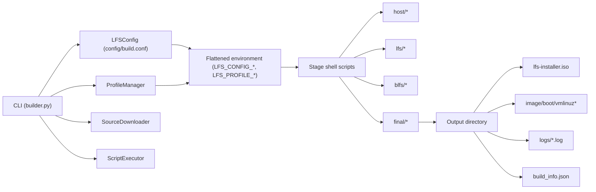
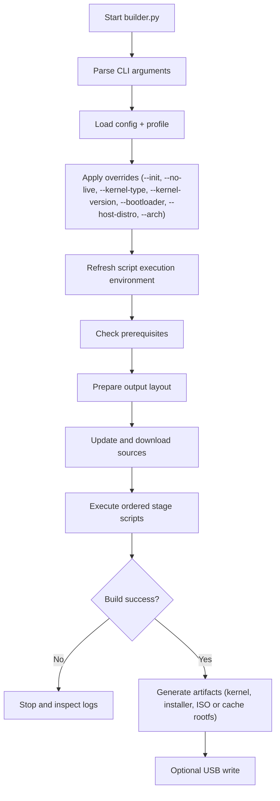

# Way Beyond Linux From Scratch

[](https://github.com/landrevillejf/beyond-linux-from-scratch/releases)
[](LICENSE)
[]()

[](https://codecov.io/gh/landrevillejf/beyond-linux-from-scratch)

Way Beyond Linux From Scratch is an automated LFS/BLFS distribution builder. It orchestrates host preparation, toolchain construction, LFS core build, BLFS layers, kernel generation, installer creation, and optional live ISO output through a single Python entry point (`builder.py`).

This repository is designed for reproducible, profile-driven builds and CI/CD publication workflows that separate:

1. Cache generation pipelines
2. Full ISO release pipelines
3. ISO-from-cache reconstruction pipelines

## Table of contents

- [Features](#features)
- [Documentation pages](#documentation-pages)
- [Project goals and philosophy](#project-goals-and-philosophy)
- [Architecture](#architecture)
- [Build pipeline flow](#build-pipeline-flow)
- [Repository structure](#repository-structure)
- [System requirements](#system-requirements)
- [Quick start](#quick-start)
- [Command line reference](#command-line-reference)
- [Build profiles](#build-profiles)
- [Configuration model](#configuration-model)
- [Artifacts and outputs](#artifacts-and-outputs)
- [USB writing](#usb-writing)
- [Custom sources](#custom-sources)
- [GitHub Actions workflow model](#github-actions-workflow-model)
- [Testing and quality gates](#testing-and-quality-gates)
- [Troubleshooting](#troubleshooting)
- [Security and support](#security-and-support)
- [Contributing](#contributing)
- [License](#license)
- [Preview XFCE desktop with branding](https://htmlpreview.github.io/?https://github.com/landrevillejf/beyond-linux-from-scratch/blob/main/docs/branding-visual-mockup-desktop.html)

## Features

- **Profile-based builds**: choose from 17 predefined profiles (minimal, full desktop, security-hardened, audio production, ARM64, etc.).
- **Flexible init systems**: sysvinit, systemd, OpenRC, runit, s6.
- **Desktop environments**: XFCE, GNOME, KDE Plasma, LXQt, Phosh (mobile), or no GUI.
- **Book compliance**: stages follow LFS 13.0 / BLFS 13.0: packages are built with the exact commands from the books, with the books' error policy enforced.
- **Cross-compilation**: build for ARM64 (aarch64) on an x86_64 host using QEMU user emulation and cross-toolchains; target arch can be overridden with `--arch`.
- **Cache support**: restore a pre-built root filesystem from a remote cache to skip compilation (`--use-cache`, `--cache-only`; useful for CI/CD).
- **Live ISO generation**: produce a hybrid BIOS/UEFI ISO with a squashfs live system and persistence support.
- **LUKS encryption**: full-disk encryption support via the `luks-encryption` stage.
- **Calamares installer**: graphical system installer integration.
- **Complete software stacks**: basic networking, multimedia (PipeWire/PulseAudio, GStreamer, ffmpeg, mpv, VLC), server packages (Apache, MariaDB, PostgreSQL, Samba, OpenSSH, ...), printing and scanning (CUPS, SANE, Gutenprint).
- **Security and privacy**: kernel hardening, nftables firewall, fail2ban, auditing (AIDE), and privacy tools.
- **Java development stack**: JDK, Maven, Gradle, Tomcat and containers tooling via the `java-dev` stage.
- **USB writing**: write the ISO directly to a USB drive with partition unmounting.
- **Parallel downloads**: fetch source tarballs concurrently, with configurable timeouts and retries.
- **Resume capability**: restart from a failed stage without redoing previous work.
- **Build validation**: final `validate` stage checks the produced image before publication.
- **Supply-chain artifacts**: GPG-sign the ISO (`--sign-iso`) and generate an SPDX SBOM (`--sbom`).
- **Milestone naming**: tag ISO filenames with a milestone label (`--milestone alpha1`).
- **Comprehensive logging**: detailed logs per stage, with last 150 lines displayed on failure.
- **Professional branding**: custom themes, wallpapers, and GRUB backgrounds for the installer and live system (see [Branding](docs/BRANDING.md)).

## Documentation pages

- [Overview](docs/content.md)
- [Features](docs/features.md)
- [Stage Timings](docs/stage-timings.md)
- [Professional Branding System](docs/BRANDING.md)
- [Installer Branding](docs/INSTALLER_BRANDING.md)
- [Branding Visual Reference](docs/branding-visual-mockup.html)
- [LPM Package Manager](docs/lpm.md)
- [LPM Full Documentation](docs/LPM_DOCUMENTATION.md)
- [Troubleshooting](docs/troubleshoot.md)
- [Docker How-To](docs/docker-howto.md)
- [Release How-To](docs/make-release-how-to.md)
- [Testing How-To](docs/testing-howto.md)
- [Wallpaper Generator How-To](docs/wallpaper-generator-howto.md)

## Project goals and philosophy

This project follows three core principles:

1. **LFS first**: builds are aligned with Linux From Scratch and Beyond Linux From Scratch stage sequencing.
2. **Single orchestrator**: `builder.py` is the source of truth for profile selection, parameter propagation, and stage execution.
3. **Reproducible automation**: CI workflows produce deterministic outputs (cache archives, kernels, ISO installers) with explicit verification steps.

## Architecture

### High-level component architecture



### Runtime responsibility split

| Layer | Responsibility |
|---|---|
| `builder.py` | CLI parsing, profile application, environment propagation, stage orchestration |
| `host/*.sh` | Host checks, host preparation, disk image and toolchain setup |
| `lfs/*.sh` | Core LFS base and system construction |
| `blfs/*.sh` | Desktop, applications, package management, hardening, updater layers |
| `final/*.sh` | Initramfs, bootloader, installer, live ISO generation |
| `.github/workflows/*.yml` | CI/CD automation: cache pipelines, nightly builds, release publication |

## Build pipeline flow



### Default stage order (`BUILD_STAGES` in `builder.py`)

Profiles include or skip stages as needed (for example GUI stages are
skipped for headless profiles, and `qemu-setup`/`uboot` only run for
cross-compiled architectures). The master ordered list is:

1. `host-check`
2. `host-prepare`
3. `qemu-setup` (cross-compile architectures)
4. `disk-image`
5. `toolchain`
6. `uboot` (ARM bootloaders)
7. `lfs-basic`
8. `lfs-system`
9. `init-system`
10. `service-abstraction`
11. `configure-lfs`
12. `blfs-base`
13. `blfs-libs`
14. `xorg`
15. `wayland`
16. `display-manager`
17. `build-kernel`
18. `desktop`
19. `applications`
20. `configure-desktop`
21. `java-dev`
22. `basic-networking` (profiles declaring the `network` package)
23. `multimedia` (audio profiles only)
24. `server` (profiles declaring `ssh` or `server-tools`)
25. `printing-scanning` (profiles declaring `printing`, or `all`)
26. `audio-studio` (audio profiles only)
27. `package-manager`
28. `base-packages`
29. `security`
30. `privacy`
31. `branding`
32. `calamares`
33. `first-boot`
34. `system-updater`
35. `luks-encryption`
36. `initramfs`
37. `bootloader`
38. `installer`
39. `live-system` (when enabled)
40. `validate`

## Repository structure

```text
.
|-- builder.py
|-- config/
|   |-- build.conf
|   |-- build-cross.conf
|   `-- ...
|-- host/
|-- lfs/
|-- blfs/
|-- final/
|-- packages/
|-- profiles/
|-- branding/
|-- docs/
|-- tools/
|-- tests/
|   |-- features/
|   `-- ...
`-- .github/workflows/
```

## System requirements

### Native Linux build host

| Resource | Minimum | Recommended |
|---|---:|---:|
| CPU cores | 4 | 8+ |
| RAM | 8 GB | 16+ GB |
| Disk | 50 GB free | 100+ GB free |
| Architecture | x86_64 | x86_64 |

### Supported host distributions

- Debian/Ubuntu
- Fedora/RHEL-like
- Arch

Use `--host-distro` if auto detection must be overridden:

```bash
python3 builder.py --host-distro fedora
```

### macOS and Windows

- macOS is supported through `mac-lfs-builder.sh` (Docker-based workflow).
- Windows is supported through WSL2 and Linux tooling.

## Quick start

```bash
git clone https://github.com/landrevillejf/beyond-linux-from-scratch.git
cd beyond-linux-from-scratch

# Install Python test/build dependencies
python3 -m pip install -r tests/requirements-test.txt

# List available profiles
python3 builder.py --list-profiles

# Build default profile (xfce)
python3 builder.py
```

Common variants:

```bash
# Minimal CLI system
python3 builder.py --profile minimal

# SysV init build
python3 builder.py --profile xfce --init sysvinit

# Server rootfs (no live ISO)
python3 builder.py --profile server --no-live

# ARM64 cross profile
python3 builder.py --profile arm64 --config config/build-cross.conf

# Use cache to skip compilation
python3 builder.py --profile xfce --use-cache

# Resume a failed build from the "desktop" stage
python3 builder.py --resume-from desktop

# Write the ISO to a USB drive
python3 builder.py --write-usb /dev/sdb

# Generate sources.list and exit
python3 builder.py --generate-sources-list
```

## Command line reference

| Option | Description |
|---|---|
| `--profile` | Build profile (`xfce` by default) |
| `--output` | Output directory (`./lfs-build` by default) |
| `--config` | Configuration file path (`config/build.conf`) |
| `--download-timeout` | Timeout in seconds for each download (default: from config or 300) |
| `--download-retries` | Number of retries for failed downloads (default: from config or 3) |
| `--stage-timeout` | Timeout in seconds for each build stage (default: 7200; raise for qemu-emulated cross builds) |
| `--resume-from` | Resume from a specific stage |
| `--write-usb <device>` | Write generated ISO to a USB device |
| `--list-profiles` | Print available profiles |
| `--profile-info <profile>` | Print profile details |
| `--clean` | Interactive cleanup of output directory |
| `--verbose`, `-v` | Enable debug logs |
| `--init` | Init override (`systemd`, `sysvinit`, `openrc`, `runit`, `s6`) |
| `--no-live` | Disable live-system stage |
| `--version` | Print builder version |
| `--use-cache` | Use cache metadata to restore prebuilt image |
| `--cache-only` | Require cache hit; fail otherwise |
| `--cache-url` | Override cache metadata URL |
| `--kernel-type` | Kernel type (`linux`, `linux-libre`, `gnu-hurd`, `freebsd`) |
| `--host-distro` | Host distro override (`debian`, `fedora`, `arch`, `auto`) |
| `--bootloader` | Bootloader override (`grub`, `uboot`, `aboot`) |
| `--generate-sources-list` | Generate `packages/sources.list` and exit |
| `--kernel-version` | Kernel version override (e.g. `6.16.1`, `6.12.20`) |
| `--arch` | Target architecture (`x86_64`, `aarch64`) |
| `--sign-iso [GPG_KEY]` | Sign the generated ISO with GPG (optional key ID or email) |
| `--sbom` | Generate an SPDX software bill of materials after the build |
| `--milestone` | Milestone tag for ISO naming (e.g. `alpha1`, `beta1`, `rc1`) |
| `--nightly` | Nightly build mode: append today's date to the ISO filename |

## Professional Branding System

The builder includes a complete professional branding system spanning the entire distribution lifecycle:

### Features
- **🎨 Installer Branding**
  - Branded GRUB boot menu with custom backgrounds
  - Forest Green color scheme (primary) with Light Green accents
  - Custom ISO volume label and publisher metadata
  - Professional splash screens
  
- **🖼️ Live System Branding**
  - Professional desktop themes (LFS-Dark, LFS-Light)
  - Branded icon packs (Papirus Dark/Light)
  - Custom wallpapers with system colors
  - Configuration files with branding manifest
  
- **🎯 Complete Customization**
  - Central TOML configuration (`branding/branding.toml`)
  - Profile-specific presets (default, custom)
  - Desktop-specific customization (XFCE, GNOME, KDE, LXQt)
  - Automatic image generation (PPM format, zero dependencies)
  - Environment variable controls

### Documentation
See the [Professional Branding System](docs/BRANDING.md) and [Installer Branding](docs/INSTALLER_BRANDING.md) documentation for detailed information.

View the [Desktop Branding Mockup](docs/branding-visual-mockup.html) for a visual reference.

## Build profiles

Profiles are defined in `ProfileManager` and drive stage inclusion and defaults.

---

| Profile | Description | Desktop | Live | Size (GB) | Build time (h) |
|---|---|---|---:|---:|---:|
| `minimal` | Minimal command-line only system | none | No | 1 | 2 |
| `gnu-free` | 100% free software system | none | No | 3 | 4 |
| `gnu-free-full` | Full GNU stack | xfce | Yes | 10 | 8 |
| `xfce` | XFCE desktop environment | xfce | Yes | 4 | 4 |
| `gnome` | GNOME desktop environment | gnome | Yes | 8 | 8 |
| `kde` | KDE Plasma desktop environment | kde | Yes | 10 | 12 |
| `lxqt` | Lightweight LXQt desktop | lxqt | Yes | 2 | 3 |
| `java-dev` | Java development stack on XFCE | xfce | Yes | 10 | 6 |
| `server` | Server-oriented profile | none | No | 2 | 3 |
| `secure` | Hardened profile with privacy tools | xfce | Yes | 6 | 5 |
| `full` | Full feature profile | gnome | Yes | 20 | 12 |
| `audio-cli` | Headless audio production | none | No | 2 | 3 |
| `audio-studio` | Desktop audio production (LV2 + NeuralRack) | xfce | Yes | 8 | 6 |
| `arm64` | ARM64 server profile | none | No | 2 | 3 |
| `pinebook` | Pinebook profile | xfce | No | 4 | 4 |
| `brax3` | Brax3 smartphone profile | phosh | No | 4 | 5 |
| `custom` | User-defined profile template | none | No | 5 | 5 |

---

## Configuration model

Primary configuration file: `config/build.conf` (JSON).

Key sections:

- `init_system`: selected init, service style, restart policy
- `kernel`: kernel version/type/config and module list
- `live_system`: live ISO behavior (compression, persistence, default boot)
- `package_manager`: LPM behavior
- `system_updater`: update policy
- `security`: hardening, firewall, auditing, privacy flags
- `bootloader`: grub/uboot metadata
- `repositories`: source list endpoints

At runtime, builder exports all configuration and profile values to shell stages:

- Fixed env vars: `LFS`, `PROFILE`, `INIT_SYSTEM`, `KERNEL_TYPE`, etc.
- Flattened vars: `LFS_CONFIG_*` and `LFS_PROFILE_*`

These values are preserved inside built systems in:

```text
/etc/lfs-builder-params.env
```

### Branding configuration

Branding is now fully configurable from `config/build.conf`:

```json
"branding": {
  "preset": "default",
  "dir": "",
  "theme_variant": "dark",
  "gtk_theme": "",
  "icon_theme": "",
  "wallpaper": "lfs-wallpaper.png",
  "apply_desktops": "auto",
  "strict": false
}
```

Behavior:

1. `preset` selects `branding/<preset>/`.
2. `dir` can override with an absolute or repository-relative path.
3. `theme_variant`, `gtk_theme`, and `icon_theme` control theme identity.
4. `apply_desktops` accepts `auto`, `all`, or a comma list (`xfce,gnome,kde,lxqt,phosh`).
5. `strict` turns missing assets into hard errors.

Branding stage outputs:

- `/etc/lfs-builder-params.env`
- `/etc/lfs-branding-manifest.txt` (installed assets + checksums)

## Artifacts and outputs

Default output tree (`--output`):

```text
<output>/
|-- build_info.json
|-- logs/
|-- sources/
|-- image/
|   `-- boot/vmlinuz*
`-- lfs-installer.iso   (if live enabled)
```

Typical outputs:

- Live builds: ISO + kernel + logs + metadata
- Non-live builds (`--no-live`): root filesystem image tree + kernel + logs
- Cache workflows: compressed rootfs cache archive (`.tar.zst`)

## USB writing

The `--write-usb` option writes the generated ISO to a USB drive.

- On Linux, it automatically unmounts any mounted partitions on the device (by reading `/proc/mounts`) before running `dd`.
- On macOS, it uses `rdisk` for faster raw writing.
- The script asks for confirmation (`Type 'YES' to continue`) before overwriting.
- After writing, it ejects the device (on Linux) and syncs.

## Custom sources

You can add custom source URLs (e.g., for private mirrors or additional packages) by creating a file `packages/custom-sources.list`. Each line should contain a URL to a tarball. The builder will append these to the main `sources.list` during the download stage.

## GitHub Actions workflow model

### Workflow architecture

```mermaid
graph TD
    A["Cache workflows"] --> A1["xfce-sysvinit-x86_64-build-cache.yml"]
    A --> A2["xfce-systemd-x86_64-build-cache.yml"]
    A --> A3["build-rootfs-cache.yml"]
    A --> A4["cache-packages.yml"]

    B["ISO release workflows"] --> B1["xfce-live-boot-iso.yml"]
    B --> B2["release.yml"]
    B --> B3["release-multi-host.yml"]
    B --> B4["nightly.yml"]
    B --> B5["weekly-full.yml"]
    B --> B6["arm64-xfce.yml"]

    C["Cache-driven builds"] --> C1["build-iso-from-cache.yml"]
    C --> C2["use-cache.yml"]

    D["CI and build verification"] --> D1["python-app.yml"]
    D --> D2["codeql.yml"]
    D --> D3["codacy-security-scan.yml"]
    D --> D4["validate-scripts.yml"]
    D --> D5["cross-compile.yml"]
    D --> D6["build.yml"]
    D --> D7["benchmark.yml"]
    D --> D8["lfs-build-recipes.yml"]

    E["Governance and docs"] --> E1["pr-labeler.yml"]
    E --> E2["squash-pr.yml"]
    E --> E3["docs.yml"]
    E --> E4["deploy-docs.yml"]
```



### Build and release workflow behavior

| Workflow | Purpose | Produces release | Produces ISO | Produces kernel artifact | Cache-only |
|---|---|---:|---:|---:|---:|
| `xfce-sysvinit-x86_64-build-cache.yml` | Build reusable cache rootfs | No | No | Verified in cache | Yes |
| `xfce-systemd-x86_64-build-cache.yml` | Build reusable cache rootfs | No | No | Verified in cache | Yes |
| `build-iso-from-cache.yml` | Reconstruct ISO from cache archive | Optional | Yes | Yes | No |
| `xfce-live-boot-iso.yml` | Full live ISO release pipeline | Yes | Yes | Yes | No |
| `release.yml` | Tagged release build pipeline | Yes | Yes | Yes | No |
| `nightly.yml` | Scheduled profile matrix builds | Artifact upload | Yes | Yes | No |

All release-capable workflows explicitly verify:

1. ISO presence and non-empty file
2. Kernel artifact presence (`image/boot/vmlinuz*`)
3. SHA256 checksum generation for published assets

## Testing and quality gates

Test suite location:

```text
tests/
```

Includes:

- Unit tests
- Integration tests
- BDD feature tests (`tests/features/*.feature`)
- Coverage measurement

Current baseline in this repository:

- `builder.py` coverage target: 100%
- BDD scenarios are executable through pytest + `pytest-bdd`

Run locally:

```bash
python3 -m pip install -r tests/requirements-test.txt
python3 -m pytest tests/ --cov=builder --cov-report=term-missing
```

## Troubleshooting

### Build stops at prerequisites

- Confirm host dependencies are installed.
- Use `--host-distro` when distro detection is ambiguous.

### Live ISO missing

- Check whether `--no-live` was used.
- Verify final stages logs in `<output>/logs/`.

### Kernel missing in output

- Inspect `lfs/08-build-kernel.sh` stage log.
- Confirm `kernel.type` in config and source availability.

### Resume after failure

```bash
python3 builder.py --resume-from <stage-name> --profile <profile> --output <output-dir>
```

### Regenerate source list

```bash
python3 builder.py --generate-sources-list
```

## Security and support

- Security policy: [SECURITY.md](SECURITY.md)
- Changelog: [CHANGELOG.md](CHANGELOG.md)
- Advanced notes: [ADVANCED.md](ADVANCED.md)

## Contributing

Please read [CONTRIBUTING.md](CONTRIBUTING.md) before submitting pull requests.

## License

This project is licensed under GPLv3. See [LICENSE](LICENSE).
